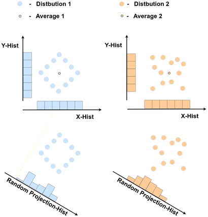

# [SINBAD - Set Features for Fine-grained Anomaly Detection](https://arxiv.org/abs/2302.12245)

Official PyTorch Implementation for the "Set Features for Fine-grained Anomaly Detection" paper.




## Getting Started


### Setup 
1. Clone this repo:
```bash
git clone https://github.com/NivC/SINBAD.git
cd SINBAD
```
2. Create a new environment and install the libraries:
```bash
virtualenv -p python3 venv
source venv/bin/activate.csh
pip install -r requirements.txt
```

## Data preparation
1. Download the data:
```
mkdir ../dataset_loco
cd ../dataset_loco
wget https://www.mydrive.ch/shares/48237/1b9106ccdfbb09a0c414bd49fe44a14a/download/430647091-1646842701/mvtec_loco_anomaly_detection.tar.xz
tar -xf mvtec_loco_anomaly_detection.tar.xz
```
2. Prepare the data:
```
cd ../SINBAD/
python data_to_matrices.py 
This creates numpy matrices of the data under ../dataset_loco
```

## Single pyramid level run
1. Create the directory where the anomaly scores and labels will be saved
```
mkdir ../sinbad_runs
``` 
3. Run the model for a single pyramid level:
```
python sinbad_single_layer.py --mvtype breakfast_box_loco  --pyramid_level 7
``` 

`pyramid_level` correspond to the level of the pyramid to be used as follows: <br>
`7` - 4th ResNet level (7x7 set elements) <br>
`14` - 3rd ResNet level (14x14 set elements) <br>
`224` - Raw image pixels (224x224 set elements) <br>


## Combine different pyramid levels 
This example uses slurm to run the different pyramid levels in parallel. <br>
1. Create and run scripts to run the different pyramid levels; first the ResNet blocks, and then the raw pixels ("224"):

```
mkdir ../sinbad_runs/sbatches
python create_batch_array_sinbad.py
cd ../sinbad_runs/sbatches
sh batch_master.sh
``` 

```
mkdir ../sinbad_runs/sbatches_224
python create_batch_array_sinbad_224.py
cd ../sinbad_runs/sbatches_224
sh batch_master.sh
```
Combine the results from the different pyramid levels in an ensemble:
```
cd SINBAD
python calc_anom_ensm.py 
--mvtype loco 
--version /path/to/sinbad_runs/results/ver1_pyramid_lvl_#  
--version_224  /path/to/sinbad_runs/results/ver1_pyramid_lvl_#
```
where `mvtype` is the class name (or `loco`/`struct`/`all` for a group of classes)
and `version` and `version_224` is the path to the results of the different pyramid levels created by the previous script. <br>


# Citation
If you find this useful for your research, please use the following citation:

```
@misc{https://doi.org/10.48550/arxiv.2302.12245,
  doi = {10.48550/ARXIV.2302.12245},  
  url = {https://arxiv.org/abs/2302.12245},
  author = {Cohen, Niv and Tzachor, Issar and Hoshen, Yedid},
  keywords = {Computer Vision and Pattern Recognition (cs.CV), Machine Learning (cs.LG), FOS: Computer and information sciences, FOS: Computer and information sciences},
  title = {Set Features for Fine-grained Anomaly Detection},
  publisher = {arXiv},
  year = {2023},
  copyright = {arXiv.org perpetual, non-exclusive license}
}

```
